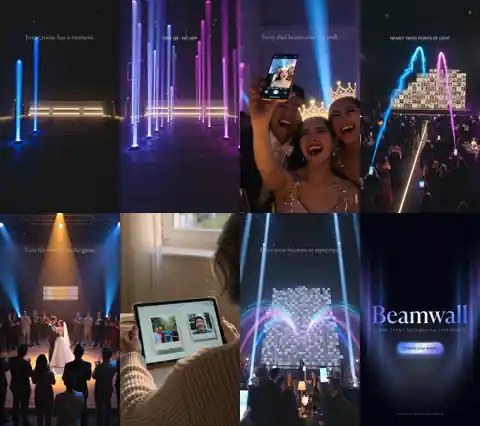

# Beamwall — Week-One Social Kit (2026-08)

Everything needed to run the first week of Beamwall socials on TikTok, Instagram and Reddit.
Produced 2026-08-02 with Higgsfield (Kling 3.0 pro video · Nano Banana Pro 2K images · Seed Audio VO), from the beam-identity brand system and the landing-page feature films.

- **Posting plan, captions, hashtags, Reddit posts, VO scripts, per-video text supers:** [`content-calendar.md`](./content-calendar.md)
- **Preview thumbnails:** [`previews/`](./previews/) (tiny QC contact sheets — the real assets are the CDN links below)
- All assets also live in the Higgsfield workspace gallery (account: dapo@rethinkreality.ai).

## The 60-second platform teaser (week anchor — post Sunday)

Fully finished master: six cinematic scenes (beams ignite → AR booth → particle wall → challenges → morning-after keepsake → finale), baked Cormorant/Jost supers, Simone VO (55 s) over ducked scene audio, branded end card. 1080×1920, 62 s, H.264.

| Asset | Link |
|---|---|
| **Teaser master (9:16, 62 s, 37.6 MB)** | https://d2ol7oe51mr4n9.cloudfront.net/user_33Txeg6YsaHeKOwmprAOf8Wr55B/e9fed7b0-1839-4990-b394-9b2eaa70610c.mp4 |
| Teaser VO only (wav, 55.2 s) | https://d8j0ntlcm91z4.cloudfront.net/user_33Txeg6YsaHeKOwmprAOf8Wr55B/hf_20260802_002454_4fd894ad-10ed-4106-a4e9-205ea1f501e1.wav |

Keyframes: 

## Feature videos (9:16 · 10 s · Kling 3.0 pro · native sound)

Deliberately clean of baked text — add the per-video supers from `content-calendar.md` §5 as native TikTok/IG text (platform-native text out-performs baked text and keeps the footage reusable).

| Feature | Treatment | Link |
|---|---|---|
| AR Booth | visual (crown tracks a smile) | https://d8j0ntlcm91z4.cloudfront.net/user_33Txeg6YsaHeKOwmprAOf8Wr55B/hf_20260802_001857_6f7814b8-d7ea-4cd2-9170-8c5bf3cf4bd8.mp4 |
| Live Wall (hero) | visual, pair with VO below | https://d8j0ntlcm91z4.cloudfront.net/user_33Txeg6YsaHeKOwmprAOf8Wr55B/hf_20260802_001920_327df9b4-de72-4d73-8440-d6bf92d2034d.mp4 |
| Challenges + AI verify | visual (+50 chip → leaderboard) | https://d8j0ntlcm91z4.cloudfront.net/user_33Txeg6YsaHeKOwmprAOf8Wr55B/hf_20260802_001923_ef879335-516a-4e35-8f75-e07e85e3359f.mp4 |
| Keepsake Cards | emotional, pair with VO below | https://d8j0ntlcm91z4.cloudfront.net/user_33Txeg6YsaHeKOwmprAOf8Wr55B/hf_20260802_001926_f975109d-c1dc-445a-9d0e-56eaec5cd4a5.mp4 |
| AI Event Concierge | typed sentence re-skins the event, pair with VO | https://d8j0ntlcm91z4.cloudfront.net/user_33Txeg6YsaHeKOwmprAOf8Wr55B/hf_20260802_001938_800f0d61-20e1-4366-8f1c-c712cd8848f9.mp4 |
| AI Frame Studio | three cards materialize → phone wears them | https://d8j0ntlcm91z4.cloudfront.net/user_33Txeg6YsaHeKOwmprAOf8Wr55B/hf_20260802_001944_c7c6c0b2-d78b-4b02-a54a-f469c9afec4d.mp4 |
| Asset Configurator | cap colorways + "Amara" engraving | https://d8j0ntlcm91z4.cloudfront.net/user_33Txeg6YsaHeKOwmprAOf8Wr55B/hf_20260802_001949_3a64b04c-481c-4e10-96ce-90c030407b22.mp4 |
| Cross-device Beam demo | phone → laptop, one take | https://d8j0ntlcm91z4.cloudfront.net/user_33Txeg6YsaHeKOwmprAOf8Wr55B/hf_20260802_001954_63620261-70be-4974-923f-fa961847f35d.mp4 |

Feature VOs (Simone, wav — optional overlays for the three VO-treatment posts):

- Live Wall (15.3 s): https://d8j0ntlcm91z4.cloudfront.net/user_33Txeg6YsaHeKOwmprAOf8Wr55B/hf_20260802_003442_0c564bac-9fad-421e-9ce5-7fd927a2f4f7.wav
- AI Concierge (17.7 s): https://d8j0ntlcm91z4.cloudfront.net/user_33Txeg6YsaHeKOwmprAOf8Wr55B/hf_20260802_003445_70311fbe-5326-4ef8-8cd3-02a92073e61a.wav
- Keepsake Cards (15.4 s): https://d8j0ntlcm91z4.cloudfront.net/user_33Txeg6YsaHeKOwmprAOf8Wr55B/hf_20260802_003448_2682ff20-6e73-4369-bd95-3ed87398a1e2.wav

## Feature images (4:5 IG feed · Nano Banana Pro 2K · baked headlines)

| Post | Link |
|---|---|
| AR Booth — "A photo booth in every pocket." | https://d8j0ntlcm91z4.cloudfront.net/user_33Txeg6YsaHeKOwmprAOf8Wr55B/hf_20260802_001746_b4fa8b01-044d-43d6-8aa6-870e90b39285.png |
| Live Wall — "Every shot beams onto the wall. Live." | https://d8j0ntlcm91z4.cloudfront.net/user_33Txeg6YsaHeKOwmprAOf8Wr55B/hf_20260802_001752_dec70faf-1d0c-461d-bd6f-8e29d84a1b8d.png |
| Challenges — "Turn the room into the game." | https://d8j0ntlcm91z4.cloudfront.net/user_33Txeg6YsaHeKOwmprAOf8Wr55B/hf_20260802_001757_d13d284f-2a21-4af6-8a49-f6fcecdbb351.png |
| Keepsake Cards — "The morning-after keepsake." | https://d8j0ntlcm91z4.cloudfront.net/user_33Txeg6YsaHeKOwmprAOf8Wr55B/hf_20260802_001802_23fc2c03-c203-49f7-8399-8e26b44637e7.png |
| AI Concierge — "Describe it. Watch it become real." | https://d8j0ntlcm91z4.cloudfront.net/user_33Txeg6YsaHeKOwmprAOf8Wr55B/hf_20260802_001815_bf324132-dd11-419e-8044-e51e830ea7c3.png |
| AI Frame Studio — "Type it. See it. Use it." | https://d8j0ntlcm91z4.cloudfront.net/user_33Txeg6YsaHeKOwmprAOf8Wr55B/hf_20260802_001820_cf684208-784f-4ad6-88fa-a5cb3489da6f.png |
| Configurator — "Their name on it. Every guest." | https://d8j0ntlcm91z4.cloudfront.net/user_33Txeg6YsaHeKOwmprAOf8Wr55B/hf_20260802_001825_4175b29f-9eb8-416c-b192-ef30a93d9f08.png |
| Beam demo — "Your phone is the booth." | https://d8j0ntlcm91z4.cloudfront.net/user_33Txeg6YsaHeKOwmprAOf8Wr55B/hf_20260802_001830_c7cc2dfd-554d-4244-90ff-196ade9e792e.png |
| Monday mystery — "The wall is waiting." (no logo, curiosity post) | https://d8j0ntlcm91z4.cloudfront.net/user_33Txeg6YsaHeKOwmprAOf8Wr55B/hf_20260802_001835_9170ec2c-fb19-4b8f-add1-67599704d480.png |
| End card 9:16 (reusable outro/story frame) | https://d8j0ntlcm91z4.cloudfront.net/user_33Txeg6YsaHeKOwmprAOf8Wr55B/hf_20260802_002055_8006a464-8cb1-4d54-9a17-c3f711c54d0c.png |

## Production notes

- Every asset was visually QC'd (composition, brand palette `#05060B`/`#5B8CFF`→`#7C6CF7`, text spelling) before sign-off; preview contact sheets are in `previews/`.
- Copy follows the brand guardrails: exact pricing only, participation stat always quoted as the full 65–85 % vs 30–45 % range, "magic" reserved for the beam, no fake urgency, CTAs limited to "Start free" / "Create your event". Reddit posts are maker-disclosed in the first lines.
- One known nit: the Configurator video shows a small decorative gold squiggle on the cap brim in one beat (reads as stitching at speed). Regenerate if it bothers you — a retake is 25 credits.
- Budget: ~410 of 920 Higgsfield credits spent; ~510 remain for retakes/extensions (10 s pro video = 25, 2K image = 2).
- 16:9 variants: run Higgsfield `reframe` on any video URL if a landscape cut is needed (e.g. YouTube).
